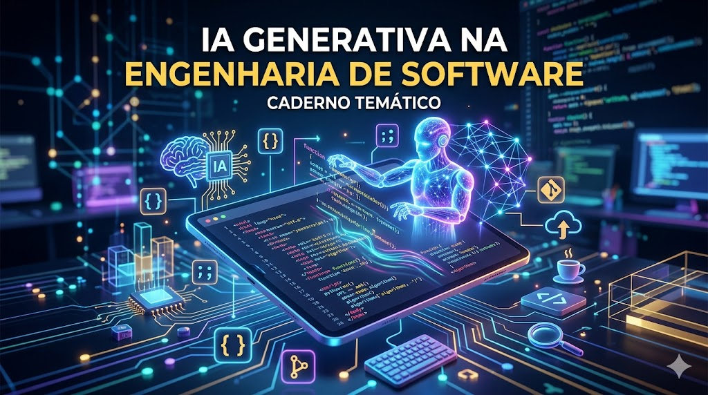

# 🚀 NotebookLM: IA Generativa na Engenharia de Software

IA Generativa na Engenharia de Software
Contexto e Objetivos
Este documento explora a transformação estrutural pela qual a Engenharia de Software está passando, impulsionada pela adoção da Inteligência Artificial Generativa (GenAI) e, mais especificamente, pela ascensão de sistemas autônomos conhecidos como Agentic AI
. O material documenta a transição de ferramentas que apenas sugerem blocos de código (Engenharia de Software 1.5 e 2.0) para sistemas que atuam como verdadeiros membros da equipe, capazes de planejar, executar, testar e revisar tarefas de ponta a ponta (Engenharia de Software 3.0)
.
O objetivo é fornecer uma visão abrangente sobre como essas tecnologias impactam o Ciclo de Vida de Desenvolvimento de Software (SDLC), analisando os ganhos de produtividade, os novos gargalos operacionais (o "Paradoxo da Produtividade"), as profundas implicações de segurança e propriedade intelectual, e a inevitável evolução do papel do desenvolvedor
. É uma leitura essencial para líderes técnicos e engenheiros que buscam integrar a IA de forma segura, governada e escalável em seus fluxos de trabalho corporativos
.
Curadoria de Fontes
Abaixo está a lista exata dos documentos e materiais de referência que fundamentam este estudo:
"(PDF) Generative AI in the Software Development Lifecycle (SDLC)"
"(PDF) Security Risks in AI-Generated Code Security Risks in AI-Generated Code Investigating Vulnerabilities Introduced by AI Coding Assistants A Research Study on Claude Code and Generative AI Development Tools - ResearchGate"
"(PDF) The State of Generative AI in Software Development: Insights from Literature and a Developer Survey - ResearchGate"
"A Ascensão da Inteligência Artificial Generativa na Engenharia de Software: Transformação Estrutural, Autonomia Agentic e o Novo Paradigma do Ciclo de Vida de Desenvolvimento"
"A Case Study Investigating the Role of Generative AI in Quality Evaluations of Epics in Agile Software Development - ResearchGate"
"AI Agent Architecture Patterns in 2026: The Complete Guide"
"AI Agent Architecture: Build Systems That Work in 2026 - Redis"
"AI and intellectual property rights - Dentons"
"AI vs Gen Z: How AI has changed the career pathway for junior developers - Stack Overflow"
"Agentes de IA (O que são e como trabalhar com eles) // Dicionário do Programador"
"Agentic DevOps in Autonomous Cloud for App Modernization"
"Architecting Autonomy: Modern Design Patterns for AI Assistants : r/AI_Agents - Reddit"
"Artificial Intelligence and Copyright - Federal Register"
"Best AI Documentation Tools in 2026 - Mintlify"
"Best AI Model for Coding in 2025 | Developer's Guide - Inexture.ai"
"Best Developer Documentation Tools in 2025: Mintlify, GitBook, ReadMe, Docusaurus"
"Best LLM for Coding in 2026: Ranked by Real Benchmarks | WhatLLM.org"
"Best LLMs for Coding and Software Development in 2026 - nexos.ai"
"Best Local LLM for Coding in 2025 | LocalLLM.in"
"Best Ollama Models: 12 Models Ranked for Coding, RAG & Agents (2026) | Morph"
"Building an AI-Native Engineering Team – Codex | OpenAI Developers"
"Claude Code vs Cursor vs GitHub Copilot: Honest Comparison After 30 Days"
"Cursor vs GitHub Copilot vs Claude Code (2026): Real Dev Verdict | Innovatrix Infotech"
"Claude e os Agentes de IA na Engenharia de Software  em 2026"
"Download the Impact of Generative AI in Software ... - DORA"
"Enterprise AI Coding Assistants: Governance, Security, IP - McKenna Consultants"
"FAQ: Privacy Statement update on Copilot data use for model training (Free/Pro/Pro+) · community · Discussion #188488 - GitHub"
"Gen AI can boost developer productivity and flow - Google Cloud"
"GitBook vs Mintlify in 2026: all the features compared"
"GitHub Copilot vs Claude Code vs Cursor vs Windsurf (2026) - Kanerika"
"How Generative AI is Changing the Software Development Landscape"
"How is Generative AI influencing software development productivity? | ResearchGate"
"O perfil de dev que vai se destacar na era da IA em 2026"
"The 10 best software documentation tools in 2026 – GitBook Blog"
"The AI-Native Developer - ACM Queue"
"The Agentic Revolution: How AI Agents Are Automating and Reshaping Software Development, QA, and DevOps - ResearchGate"
"The Hidden Costs of Coding With Generative AI | Request PDF - ResearchGate"
"The Impact of Generative AI on Software Engineering Activities"
"The Law and Economics of Generative AI and Copyright: A Primer to Core Challenges for Our Digital Future - PMC"
"The Productivity Effects of Generative AI: Evidence from a Field Experiment with GitHub Copilot - ResearchGate"
"The Rise of AI Teammates in Software Engineering (SE) 3.0: How Autonomous Coding Agents Are Reshaping Software Engineering - arXiv"
"The State of Generative AI in Software Development: Insights from Literature and a Developer Survey - arXiv"
"The legal issues presented by generative AI | MIT Sloan"
"Vibe Coding's Security Debt: The AI-Generated CVE Surge – Lab ..."
"What is Agentic DevOps? - Opsera"
"When the Vibes Are Off: The Security Risks of AI-Generated Code | Lawfare"
Miniguia de Estudo
A Transição para a Engenharia de Software 3.0 (SE 3.0): Estamos saindo da era da codificação manual ou preditiva para um paradigma onde agentes de IA autônomos (como Claude Code, Devin e Cursor) atuam como "colegas de equipe"
. Esses sistemas podem navegar por bases de código, executar comandos no terminal, criar Pull Requests e testar o próprio código, transferindo o foco humano da escrita linha a linha para a orquestração e arquitetura de sistemas
.
O Paradoxo da Produtividade: Embora desenvolvedores relatem sentir-se muito mais rápidos e produtivos escrevendo boilerplate e código repetitivo, isso muitas vezes resulta em um gargalo macroeconômico nas organizações
. A IA acelera a escrita de código, mas isso gera lotes maiores de Pull Requests, sobrecarregando a esteira de revisão e CI/CD, o que pode causar instabilidade e não reduzir o tempo gasto em burocracias e reuniões (Hipótese do Vácuo)
.
Riscos de Segurança e o "Vibe Coding Debt": O uso desenfreado da IA criou uma crise de segurança estrutural. Os desenvolvedores tendem a aceitar códigos que "parecem corretos" superficialmente, gerando aplicações vulneráveis a ataques de injeção (SQL, XSS) e falhas arquitetônicas profundas
. Além disso, a IA inventa ("alucina") frequentemente pacotes inexistentes, expondo a cadeia de suprimentos a invasores que registram esses nomes para distribuir malware (prática conhecida como slopsquatting)
.
Padrões de Arquitetura de Agentes: Em vez de depender apenas de engenharia de prompts, as equipes corporativas estão implementando padrões complexos como ReAct (Raciocínio + Ação), Reflexion (Autoavaliação do modelo), e abordagens multiagentes (Supervisor-Worker, Debate)
. A orquestração via grafos é o padrão recomendado para garantir a trilha de auditoria em ambientes corporativos
.
Governança e Propriedade Intelectual (IP): Ferramentas que treinam em código de clientes ou não deixam claro a autoria geram riscos severos. O código puramente gerado por IA geralmente não é passível de direitos autorais e as ferramentas podem sugerir trechos protegidos (como sob a licença GPL), "contaminando" projetos proprietários
. Políticas empresariais rígidas e ferramentas com proteção corporativa de IP são agora cruciais
.
A Evolução do Perfil do Desenvolvedor: O foco do profissional de software não é mais escrever o código mais rápido, já que a IA superou a velocidade humana
. Profissionais que sobreviverão serão "orquestradores de sistemas", focados em criar excelentes especificações técnicas, aplicar arquiteturas sólidas de testes e segurança, rever o código gerado e conectar as necessidades de negócio à tecnologia (habilidades T-shaped)
.
Glossário
Agentic AI / Agentes Autônomos: Sistemas de inteligência artificial que não apenas respondem a comandos estáticos, mas operam através do ciclo "Percepção-Raciocínio-Ação" (PRA)
. Eles podem decompor metas complexas, selecionar ferramentas (como APIs ou terminais), atuar no sistema e aprender com os resultados de forma independente
.
Vibe Coding Debt: Débito técnico e de segurança crítico que se acumula quando os desenvolvedores delegam inteiramente a construção do software à IA, aceitando códigos que superficialmente "parecem corretos" (pela vibe), mas que introduzem graves vulnerabilidades arquitetônicas, pacotes alucinados e falta de otimização no longo prazo
.
Model Context Protocol (MCP): Um protocolo padrão seguro que permite aos modelos e agentes de IA conectarem-se de forma direta a ferramentas externas, ambientes de desenvolvimento e fontes de dados (como bancos de dados, Jenkins, Jira ou documentações) para ler estados do projeto ou agir no mundo real, evitando scripts frágeis de APIs
.
Paradoxo da Produtividade: Fenômeno atual da era GenAI no qual o ganho isolado de velocidade de um desenvolvedor (ao gerar linhas de código mais rápido) muitas vezes se traduz em lentidão ou instabilidade sistêmica para a empresa, pois o volume massivo de código sobrecarrega as revisões de segurança e os pipelines de integração contínua
.
Slopsquatting: Uma técnica de ataque sofisticada na cadeia de suprimentos onde cibercriminosos identificam e registram nomes de pacotes ou bibliotecas inexistentes que são frequentemente "alucinados" e recomendados pelas inteligências artificiais de codificação. Quando um desenvolvedor instala o pacote sugerido pela IA sem verificar, ele acaba inserindo malware no sistema
.
---

## 🧠 Engenharia de Prompts e "Cicatrizes" (Troubleshooting)

Para extrair os melhores insights das fontes carregadas e evitar respostas genéricas ou superficiais do NotebookLM, utilizei técnicas de refinamento de prompts (*Prompt Chaining*):

*   **Prompt Inicial (Abordagem Direta):** 
    > *"Quais são os riscos de usar IA para gerar código?"*
    *   **Resultado:** A IA trouxe respostas comuns sobre segurança tradicional (falha de validação, SQL Injection).
*   **Prompt Refinado (Engenharia de Prompt):** 
    > *"Atue como um Especialista em Segurança de Aplicações (AppSec). Analise os PDFs de riscos de segurança fornecidos e liste apenas as vulnerabilidades que são EXCLUSIVAS ou severamente amplificadas pelo uso de IA Generativa, detalhando o impacto na cadeia de suprimentos."*
    *   **Resultado:** Com esse direcionamento, a IA foi capaz de mapear e cruzar os conceitos avançados de *Slopsquatting* (alucinação de pacotes) e o acúmulo de *Vibe Coding Debt*.
*   **Dificuldade Encontrada (Cicatriz):** O maior desafio técnico foi fazer o modelo diferenciar o comportamento de ferramentas de autocomplete tradicional (como o Copilot) de agentes autônomos complexos (como Claude Code e Devin). Foi necessário forçar o contexto do protocolo MCP (Model Context Protocol) para que ela compreendesse a arquitetura de execução dos agentes.

## 🔄 Prompts Reutilizáveis para Revisão Futura
Estes comandos podem ser colados diretamente no chat do NotebookLM para realizar revisões rápidas deste material:
*   `"Aja como um tech lead e crie um questionário de 5 perguntas difíceis sobre os impactos do Paradoxo da Produtividade na esteira de CI/CD, baseado nas fontes."`
*   `"Explique o funcionamento do Model Context Protocol (MCP) usando uma analogia simples para um desenvolvedor júnior."`
*   `"Gere um checklist de segurança de 3 passos que um desenvolvedor deve seguir antes de aceitar um código gerado por IA para evitar o Vibe Coding Debt."`

---

Desenvolvido por **Gabriel Motta Leite**  
